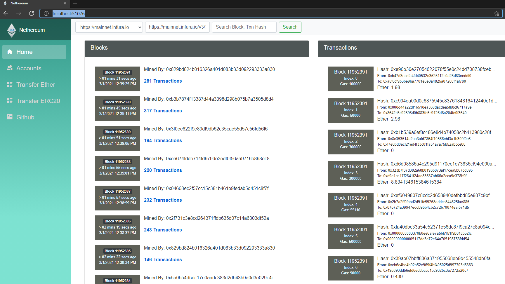
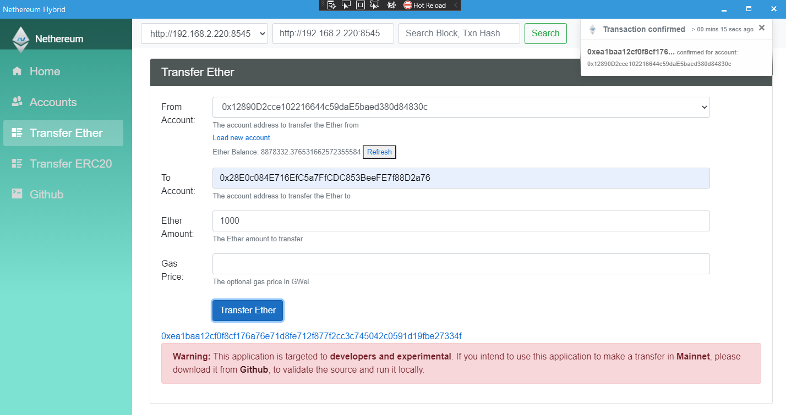

# Nethereum Explorer

Nethereum Explorer is a .Net Blazor Wasm SPA, Desktop Windows and Mac, Android and iOS light blockchain explorer and simple wallet Template.

You can try it here: http://explorer.nethereum.com

The aim of this application is to provide another wallet / client reference for the final goal of providing a reusable common mvvm front end framework and libraries targetting all Dekstops (WinForms, Xamarin.Forms, Avalonia (https://avaloniaui.net/) for Windows, Mac, Linux), Mobile (Android and iOS using Xamarin.Forms), Browser SPA (Blazor in this example, but there is also [Uno](https://platform.uno/)) and gaming / vr engines (Unity3d).
It started as a Demo of what Blazor could achieve in a complex application (when Blazor started) and was an attempt to use ReactiveUI in the browser. ReactiveUI is now fully supported in the browser thanks to the magic of the ReactiveUI team.

Now thanks to Maui Blazor (previously preview of the Blazor Mobile Hybrid) your Blazor project can also be rendered and interop with native desktop and mobile.

# More info:
* Blazor:  The .Net Html / razor wasm framework https://blazor.net/
* ReactiveUI: https://reactiveui.net/
* Blazor mobile hybrid: https://docs.microsoft.com/en-us/mobile-blazor-bindings/walkthroughs/hybrid-hello-world
* WebView2 Required to run windows applications: https://docs.microsoft.com/en-gb/microsoft-edge/webview2/gettingstarted/wpf
* Blazor.FlexGrid: The grid component used in Block Page https://github.com/Mewriick/Blazor.FlexGrid
* Infura: Infura hosts the preconfigured public Ethereum nodes https://infura.io/
* Testchains: If you need a test chain to run in your localhost  https://github.com/Nethereum/TestChains
* Etherscan: You may find that the home page is inspired by the awesome https://etherscan.io 

## Common Solution 
One of the main goals is to eventually have full support of ReactiveUI as the common framework for all the Nethereum FrontEnd example and future solutions.
Avalonia Desktop (Windows, Linux, Mac): https://github.com/Nethereum/Nethereum.UI.Desktop, WindowsForms https://github.com/Nethereum/Nethereum.SimpleWindowsWallet
Xamarin.Forms Mobile and Desktop wallets:  https://github.com/Nethereum/Nethereum.UI.Wallet.Sample

