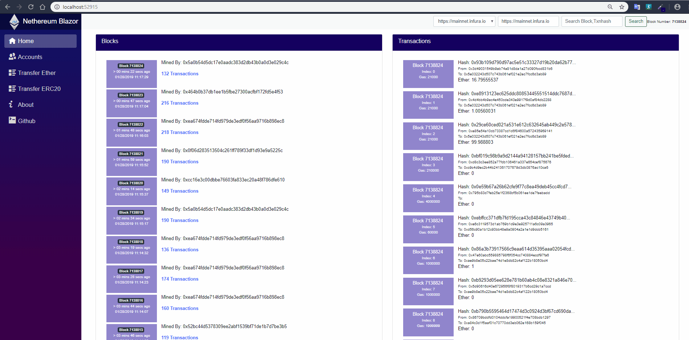

# Nethereum Blazor

Nethereum Blazor is a .Net Wasm SPA light blockchain explorer and simple wallet.

You can try it here: http://blazor.nethereum.com

The aim of this application is to provide another wallet / client reference for the final goal of providing a reusable common mvvm front end framework and libraries targetting all Dekstops (WinForms, Xamarin.Forms, Avalonia for Windows, Mac, Linux), Mobile (Android and iOS using Xamarin.Forms), Browser SPA (Blazor in this example, but there is also [Uno](https://platform.uno/)) and gaming / vr engines (Unity3d).

# More info:
* Blazor:  The .Net Html / razor wasm framework https://blazor.net/
* ReactiveUI: https://reactiveui.net/
* Blazor.FlexGrid: The grid component used in Block Page https://github.com/Mewriick/Blazor.FlexGrid
* Infura: Infura hosts the preconfigured public Ethereum nodes https://infura.io/
* Testchains: If you need a test chain to run in your localhost  https://github.com/Nethereum/TestChains
* Etherscan: You may find that the home page is inspired by the awesome https://etherscan.io 

## Blazor + ReactiveUI
One of the main goals is to eventually have full support of ReactiveUI as the common framework for all the Nethereum FrontEnd example and future solutions.
Avalonia Desktop (Windows, Linux, Mac): https://github.com/Nethereum/Nethereum.UI.Desktop, WindowsForms https://github.com/Nethereum/Nethereum.SimpleWindowsWallet
Xamarin.Forms Mobile and Desktop wallets:  https://github.com/Nethereum/Nethereum.UI.Wallet.Sample

ReactiveUI is now fully supported in Blazor, the orginal hope of this project was to provide an experimental context to enable all ReactiveUI features in Blazor to be shared across all the other frontend frameworks.

